# Week 3: Quantum Machine Learning

`local-only` `pennylane-lightning` `python-3.12` `seeds-fixed` `zero-cloud`

A five-day, fully local quantum machine learning suite built with PennyLane
(`lightning.qubit` with a `default.qubit` fallback), PyTorch, NumPy, SciPy,
scikit-learn and matplotlib. No API calls, no cloud backends, no notebooks.
Every script runs top to bottom, every figure is committed under `assets`,
and every number below was produced by the final scripts with fixed seeds.

## TL;DR results

| Task | Metric | Value |
| ---- | ------ | ----- |
| Day 11 hybrid pipeline | Final MSE | 0.006181 |
| Day 11 hybrid pipeline | Loss reduction | 95.38 percent |
| Day 12 QSVM moons | Quantum kernel accuracy | 0.8667 |
| Day 12 QSVM moons | RBF accuracy | 1.0000 |
| Day 12 QSVM HEP-like | Quantum kernel accuracy | 0.9667 |
| Day 12 QSVM HEP-like | RBF accuracy | 0.9333 |
| Day 13 QNN | Best val accuracy (depth 1) | 0.9250 |
| Day 13 QNN | Val accuracy depth 2/3/4 | 0.7750 / 0.8750 / 0.9000 |
| Day 14 VQE | VQE ground energy | -1.299291 Ha |
| Day 14 VQE | Exact diagonalization | -1.299291 Ha |
| Day 14 VQE | Blackhole cross-check | -1.299291 Ha |
| Day 14 QAOA | Expected ratio p1 / p2 | 0.4985 / 0.5464 |
| Day 14 QAOA | Best sampled cut | 8 of 8 edges |
| Day 15 QGAN | Final generator loss | 1.4000 |
| Day 15 QGAN | Final discriminator loss | 1.1210 |

## Day 11: hybrid classical-quantum pipeline

Motivation: a classical front end compresses the input into angles, a small
quantum circuit acts as a nonlinear feature map, and a classical head reads
out the prediction. The target is the fixed-seed curve
$y=\sin(x)\exp(-x/5)$, which mixes oscillation with decay and punishes
under-expressive models on the second lobe.

The circuit applies angle embedding followed by strongly entangling layers
and returns one Pauli-Z expectation per wire. Wrapped with
`TorchLayer`, it behaves like any other `torch.nn.Module` and trains with
Adam on full-batch mean squared error.

```python
qml.AngleEmbedding(inputs, wires=range(N_QUBITS))
qml.StronglyEntanglingLayers(weights, wires=range(N_QUBITS))
```

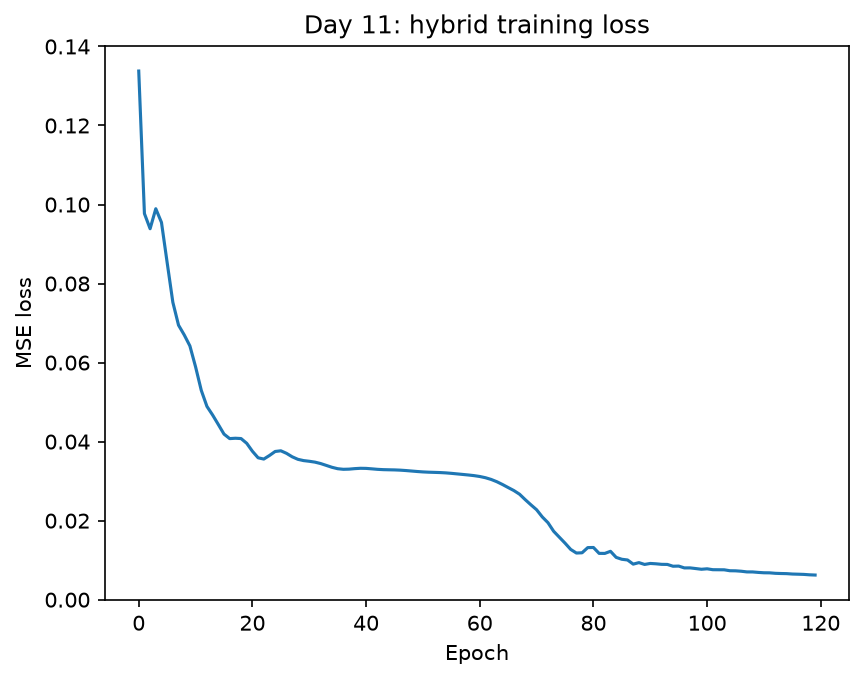

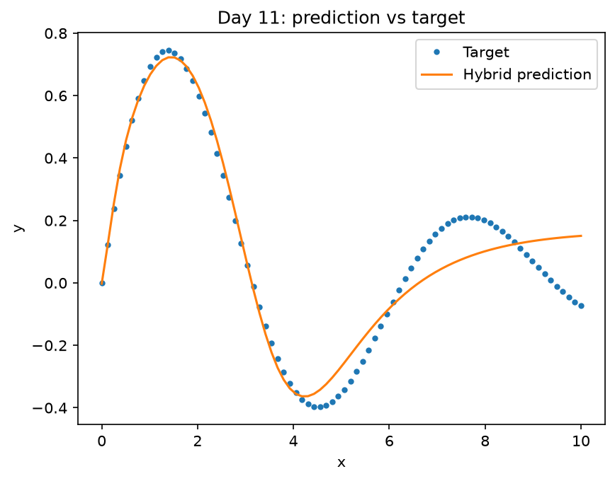

Limitations: the 4-qubit, 2-layer model reaches MSE 0.006181 (a 95.38
percent loss reduction) but visibly underfits the second oscillation lobe
near the right edge. A wider classical head or a deeper entangler would fit
better at the cost of slower simulation.

## Day 12: quantum kernel SVM

Motivation: the kernel trick replaces inner products with a feature-space
overlap, and a quantum feature map makes that overlap the squared fidelity
of two parameterised states. With $k(x,x')$ defined as below, the Gram
matrix is symmetric positive semidefinite by construction, so it drops
straight into `SVC` with a precomputed kernel.

$$ k(x,x')=\vert\langle\phi(x)\vert\phi(x')\rangle\vert^{2} $$

The map is ZZFeatureMap-style on two qubits: Hadamard layer, data-dependent
Z rotations, one entangling block with the product angle
$2(\pi-x_{0})(\pi-x_{1})$, then disentangling. Features are min-max scaled
to angle range first. We compare against a classical RBF SVM on a moons toy
set and on a deterministic synthetic HEP-like signal-versus-background set
(fixed seed 42; no CERN Open Data download is attempted in this offline
build, so the HEP-like data is synthetic by design).

```python
K = kernel_matrix(X_train, X_train)
clf = SVC(kernel="precomputed").fit(K, y_train)
```

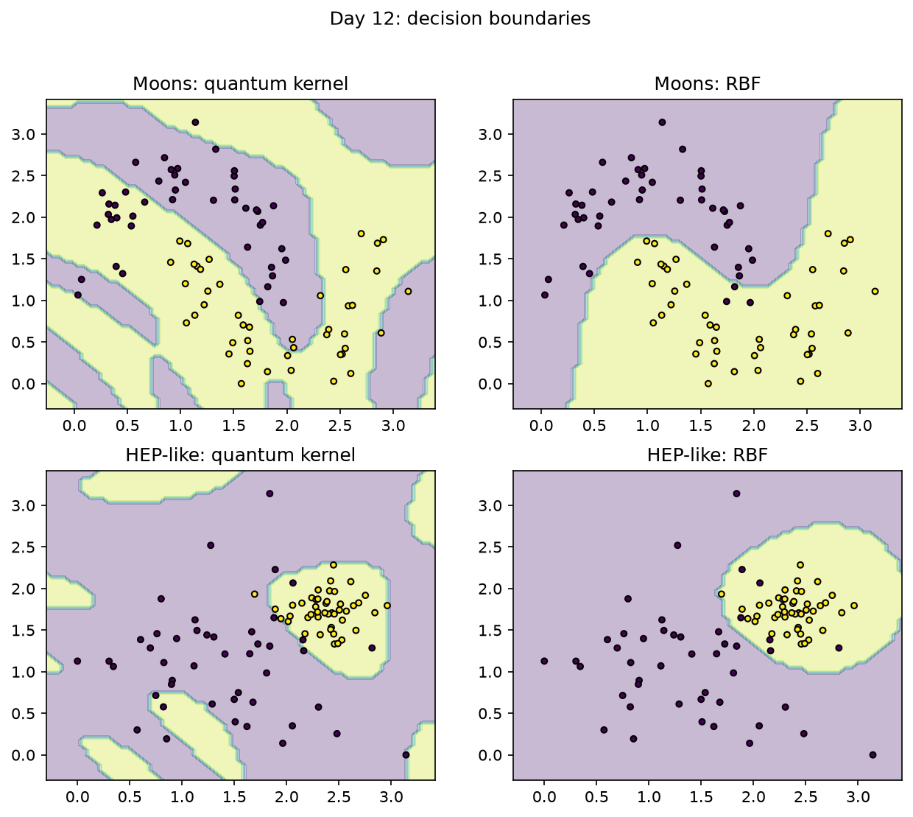

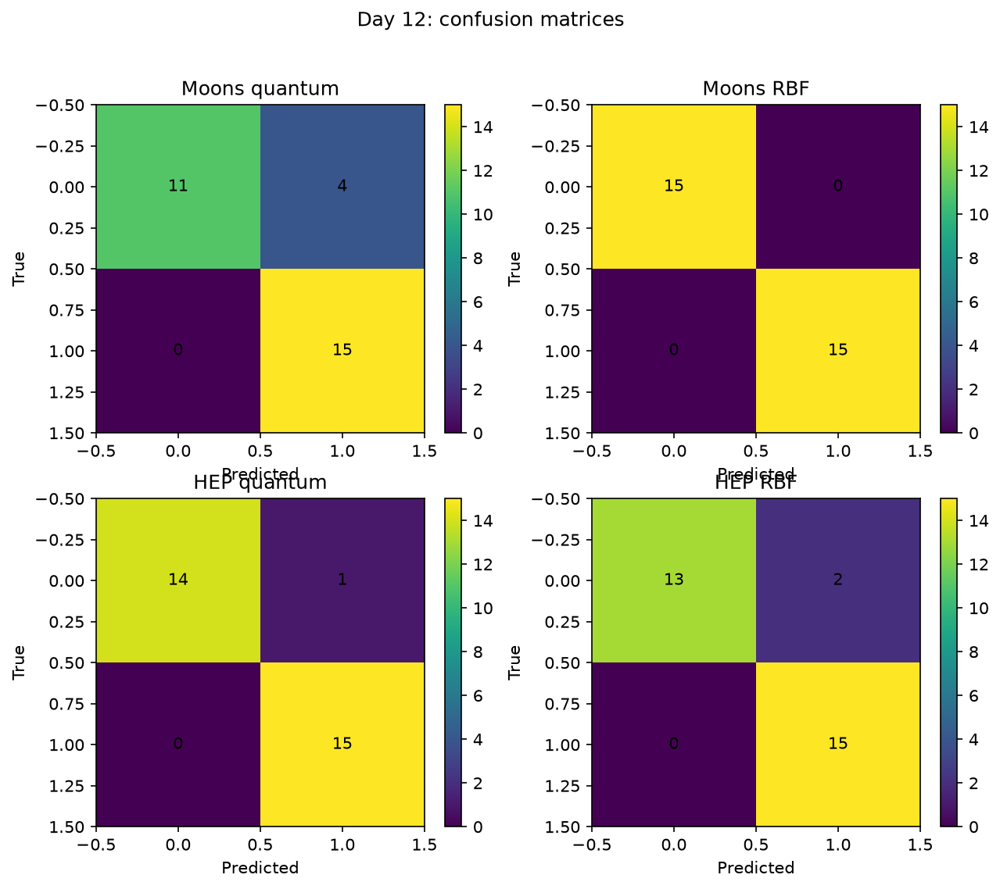

Limitations: on moons the RBF baseline wins (1.0000 versus 0.8667) because a
shallow two-qubit map is a poor inductive bias for interleaving crescents,
while on the Gaussian-like HEP blobs the quantum kernel edges ahead
(0.9667 versus 0.9333). Kernel SVMs also scale quadratically in dataset
size, since every Gram entry needs a state overlap.

## Day 13: variational classifier and depth sweep

Motivation: layer depth is the main capacity knob of a variational
classifier, but deeper circuits are harder to train. We sweep depths 1 to 4
on a stratified train and validation split of noisy moons and record
accuracy per epoch.

Gradients use the parameter-shift rule, which evaluates each circuit
parameter at two shifted points with $s=\frac{\pi}{2}$:

$$ \frac{\partial f}{\partial\theta}=\frac{f(\theta+s)-f(\theta-s)}{2} $$

Initialization strategy against barren plateaus: weights start from a narrow
Gaussian with standard deviation 0.1, so the circuit begins close to the
identity and early gradients stay informative at this width. The sweep
confirms the trade-off honestly: depth 1 reaches validation accuracy
0.9250, depth 4 reaches 0.9000, and depth 2 stalls at 0.7750 after 40
epochs under the same optimizer budget.

```python
self.qlayer.weights.data.normal_(0.0, INIT_STD)
```

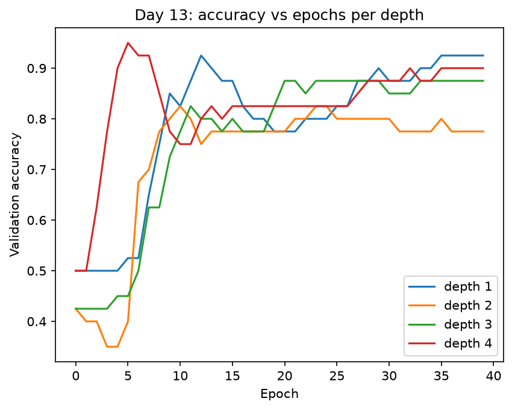

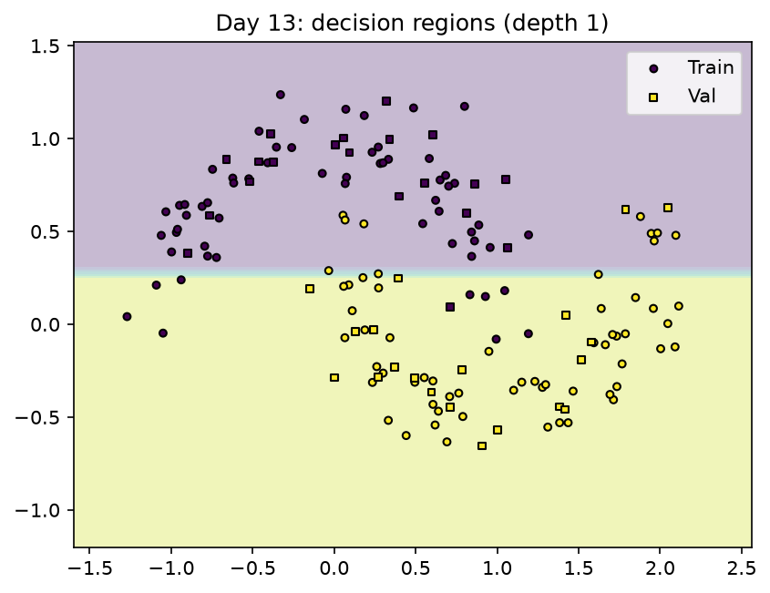

Limitations: depth is not destiny here; with only 40 epochs the deeper
models are optimizer-limited rather than expressivity-limited, and the
ranking could shift with more epochs or per-depth learning rates. Variance
across seeds is also real at this data scale.

## Day 14: VQE and QAOA

Motivation: variational algorithms trade circuit depth for classical
optimization loops. VQE minimizes the Rayleigh quotient, which bounds the
true ground energy from above with $E(\theta)\geq E_{0}$:

$$ E(\theta)=\frac{\langle\psi(\theta)\vert H\vert\psi(\theta)\rangle}{\langle\psi(\theta)\vert\psi(\theta)\rangle} $$

The 2-qubit H2-like Hamiltonian uses explicit Pauli coefficients
(II −0.4804, ZI 0.3935, IZ 0.3935, ZZ −0.0113, XX 0.1812), parameter-shift
gradients, and a 2-layer entangler. VQE reaches −1.299291 Ha, matching exact
numpy diagonalization to six decimals and agreeing with the
`blackhole.expectation` cross-check exactly.

QAOA alternates the MaxCut cost Hamiltonian over graph edges with the
transverse-field mixer, with $p=1,2$ layers:

$$ H_{C}=\sum_{(i,j)\in E}\frac{1-Z_{i}Z_{j}}{2} $$

$$ H_{M}=\sum_{i}X_{i} $$

On the 6-node, 8-edge graph, expected approximation ratios are 0.4985 at
`p=1` and 0.5464 at `p=2`, while best-of-512 seeded shots recover the full
8-edge cut in both cases.

```python
H = COEFFS["II"] * qml.Identity(0) + COEFFS["XX"] * (qml.PauliX(0) @ qml.PauliX(1))
```

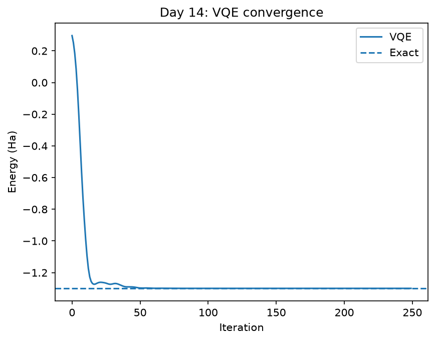

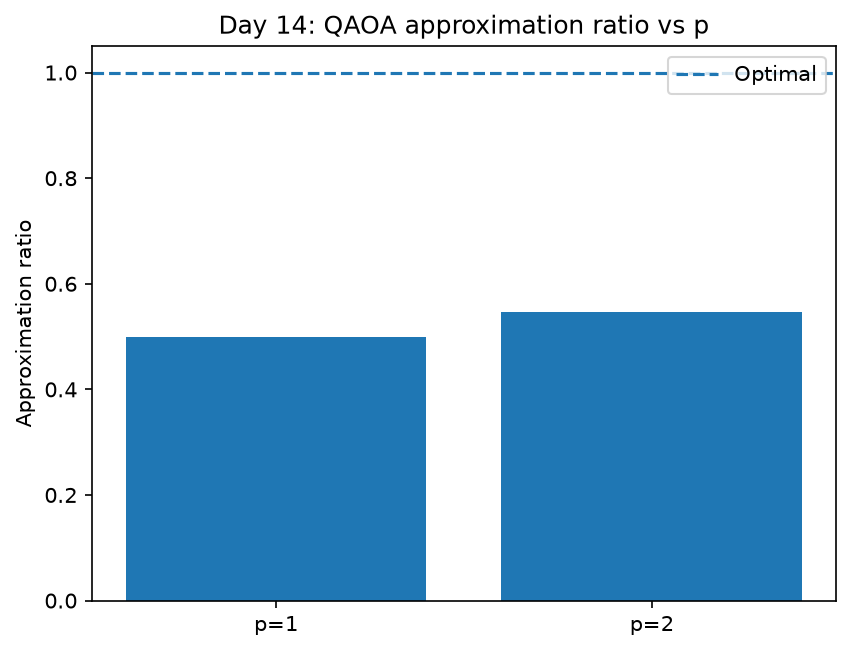

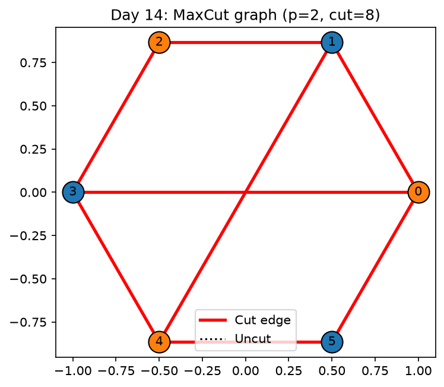

Limitations: VQE precision here reflects a tiny 4-dimensional Hilbert
space; scaling to larger molecules hits shot noise and optimizer
difficulties. Shallow QAOA expected values near 0.5 are typical without
extensive tuning, and the optimal cut is found by sampling rather than by
the mean.

## Day 15: quantum GAN

Motivation: a generator and discriminator play a minimax game over the loss
$\mathcal{L}$, with the generator trying to fool the discriminator and the
discriminator trying not to be fooled:

$$ \min_{G}\max_{D}\mathcal{L}(D,G) $$

The 1-qubit generator maps uniform noise through RY and RZ rotations to a
Pauli-Z expectation in the data range, while the discriminator is a tiny
1-16-16-1 MLP trained with binary cross entropy. The target is a two-mode
Gaussian mixture clipped to the unit interval. After 300 epochs the
generator loss settles at 1.4000 and the discriminator loss at 1.1210, and
the final histogram covers both modes.

```python
qml.RY(theta[0] * z + theta[1], wires=0)
```

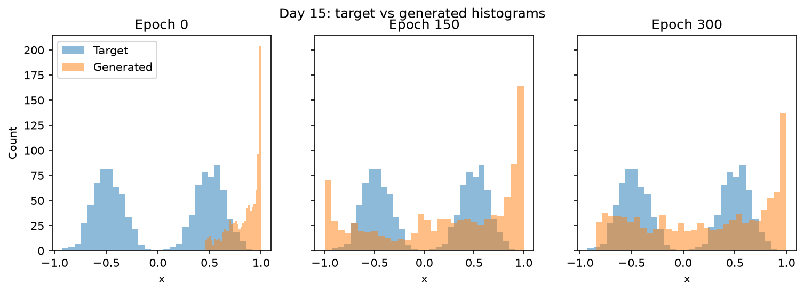

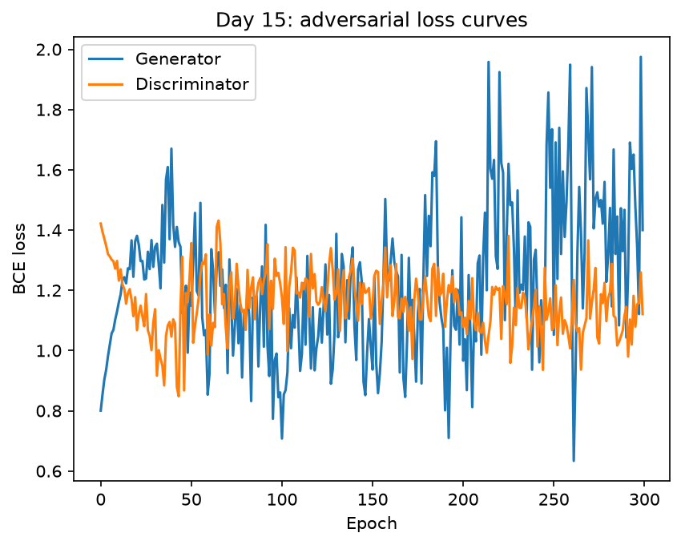

Limitations: a 3-parameter single-qubit generator cannot reproduce the
mixture exactly; excess mass piles at the range edges and the modes are
broader than the target. This is textbook mode-collapse risk on a toy
scale: the generator covers both modes only partially. Longer training or a
wider generator would sharpen the match.

## Reproduce

All commands run from the repository root in a clean Python 3.12
environment with fixed seeds. No network access is needed at run time.

```text
pip install -r requirements.txt
python day11_hybrid_pipeline/task8_hybrid_pipeline.py
python day12_qsvm/task9_qsvm.py
python day13_qnn/task10_qnn.py
python day14_vqe_qaoa/task11_vqe_qaoa.py
python day15_qgan/task12_qgan.py
python tools/lint_readme.py
pytest tests/test_week3.py -v
```

## Known limitations

Dense density-matrix simulation scales as order $4^{n}$, so every circuit
here stays at 1 to 6 qubits; larger widths need tensor-network or
cloud-scale methods outside this local brief. `lightning.qubit` is the
default device with `default.qubit` fallback, and VQE energies agree with
the `blackhole.expectation` cross-check to six decimals on the 2-qubit
Hamiltonian, though gate-level discrepancies can appear on deeper circuits.
QGAN training carries genuine mode-collapse risk, visible as edge pile-up
in the final histogram. The HEP-like dataset is deterministic synthetic
data with fixed seed 42, not real collision events, and all accuracy claims
are tied to these seeds and splits. No hype: small local models demonstrate
method, not advantage.
